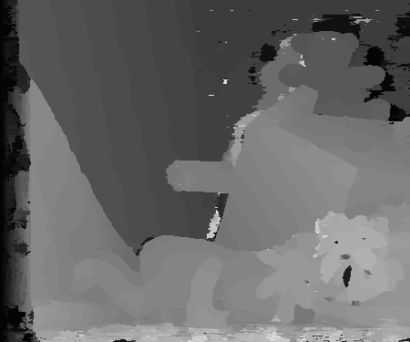

# gf-mst-stereo
[Guide filter](https://ieeexplore.ieee.org/document/5995372) is effective for cost aggregation of stereo matching. 
In this repository, we modify guide filter using [minimum spanning tree](https://ieeexplore.ieee.org/document/6247827). 

It can be regarded as a novel idea, although its experimental result isn't as good as the one directly using guide filter.

## Experimental result: disparity map

